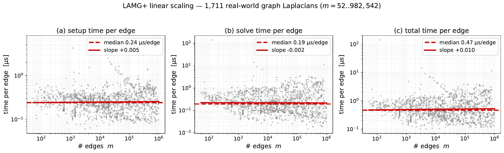

# LAMG+ — Lean Algebraic Multigrid for Graph Laplacians

A lean, **parameter-free**, empirically linear-time algebraic multigrid solver for graph-Laplacian
linear systems `Lφ = b` (spectral clustering, centrality, semi-supervised learning, finite-element
analysis, electrical flow, network-flow interior-point solves). LAMG+ is a faithful re-derivation of
Lean Algebraic Multigrid (Livne & Brandt, *SIAM J. Sci. Comput.* 2012) with two local refinements — a
strength-of-connection veto and a selective caliber-2 interpolation — plus a head-to-head study against
the modern approximate-Cholesky solver. See [`doc/lamg_plus.tex`](doc/lamg_plus.tex) for the paper.

> This repository is the **linear** LAMG+ solver only. The nonlinear flow solver that uses it —
> **[NLF](https://github.com/orenlivne/nlf)** (congestion / max-flow / min-delay routing) — lives in
> its own repository.

<p align="center"></p>

<p align="center"><em>Empirically linear-time: total solve wall-clock vs. nonzeros over the SuiteSparse corpus.</em></p>

## Requirements

- [Julia](https://julialang.org) ≥ 1.10. No other dependencies for the solver itself (only Julia
  standard libraries: `LinearAlgebra`, `SparseArrays`, `Random`, `Statistics`, `Printf`).

## Install

```julia
julia --project=. -e 'using Pkg; Pkg.instantiate()'
```

## Quickstart

```julia
using LAMG, LinearAlgebra

A = grid2d_laplacian(128, 128)        # any connected graph Laplacian L = D - W (SPD, 1 ∈ null L)
n = size(A, 1)
b = randn(n); b .-= sum(b)/n          # compatible RHS (zero mean)

h        = setup(A)                   # build the multilevel hierarchy (parameter-free)
x, info  = solve(h, b)                # solve to ‖Lx-b‖ ≤ 1e-8‖b‖, x ⟂ 1

@show info.cycles                     # multigrid cycles taken
@show norm(A*x - b) / norm(b)         # achieved relative residual
```

`setup` accepts `LAMGOptions(tol=..., max_cycles=...)`; the defaults need no tuning. To reuse one
hierarchy across many right-hand sides, call `solve(h, b1)`, `solve(h, b2)`, … on the same `h`.

## Run the test suite

```bash
julia --project=. test/runtests.jl      # 1942 tests
```

## Examples (`examples/`)

```bash
julia --project=. examples/solve_and_time.jl     # solve + time a grid
julia --project=. examples/run_corpus.jl         # solve a directory of .mtx graphs
```
`examples/compare_approxchol.jl` compares against Spielman's `approxchol_lap` and needs
[`Laplacians.jl`](https://github.com/danspielman/Laplacians.jl) (see the comparison env below).

## Reproducing the paper

The paper's experiments run over real-world graphs from the
[SuiteSparse Matrix Collection](https://sparse.tamu.edu) and [SNAP](https://snap.stanford.edu); we do
**not** ship the matrices (tens of GB). Download the `.mtx` files into `data/` (Matrix Market format).

**Figure 4.1 — linear scaling (solver only):**
```bash
julia --project=. scripts/linear_scaling_figure.jl --glob=data --out=results/scaling.csv
python3 scripts/plot_linear_scaling.py results/scaling.csv doc/scaling_v3.pdf
```

**Tables 4.1–4.3 — comparison vs approxChol / BoomerAMG.** These need a separate environment with the
competitor packages:
```bash
cd scripts/competitor_env
julia --project=. -e 'using Pkg; Pkg.develop(path="../.."); Pkg.add(["Laplacians","HYPRE","PyCall","Conda"]); Pkg.instantiate()'
cd ../..
# competition table (LAMG+ vs fast/robust approxChol, all m>1e6 graphs):
julia --project=scripts/competitor_env scripts/bench_env/run_full_tol_sweep.jl --out=results/full_tol_sweep.csv
python3 scripts/bench_env/aggregate_tol_sweep.py results/full_tol_sweep.csv
# a-priori solver-selection predictor (mean degree -> winner, ~90% accuracy):
python3 scripts/predict_crossover.py results/full_tol_sweep.csv
# multi-solver per-class table (LAMG+/approxChol/AC/BoomerAMG):
julia --project=scripts/competitor_env scripts/run_class_comparison.jl
python3 scripts/class_comparison_table.py results/class_comparison.csv
```

**Spot-check the comparison numbers (notebook).** For a fast, self-contained check that the reported
LAMG+ vs. approxChol timings reproduce, [`examples/reproduce_comparison.ipynb`](examples/reproduce_comparison.ipynb)
re-runs **both solvers live** on four entries of the comparison table and compares to the paper. It
uses the same code path as the full benchmark (loader, LCC reduction, fixed RHS, solver wrappers in
[`scripts/repro_lib.jl`](scripts/repro_lib.jl), extracted from `scripts/competitor_benchmark.jl`).
```bash
# one-time: lean reproduction environment (LAMG + Laplacians.jl only), from the repo root:
julia --project=examples/repro_env -e 'using Pkg; Pkg.develop(path="."); Pkg.add("Laplacians"); Pkg.instantiate()'
# place the four .mtx in data/ (or point $LAMGPLUS_DATA at your SuiteSparse cache):
#   SNAP__web-Stanford, SNAP__web-Google, GHS_psdef__bmwcra_1, Boeing__pwtk
cd examples && jupyter nbconvert --to notebook --execute --inplace \
    --ExecutePreprocessor.kernel_name=julia-1.12 reproduce_comparison.ipynb
```
The notebook reports reproduced-vs-reported μs/nnz and asserts that the winner and the 1e-8 convergence
match. On the reference machine the per-nonzero times land within run-to-run wall-clock variance (≤1.3×),
e.g. (μs/nnz, repro / paper):

| graph | LAMG+ | approxChol | winner (repro = paper) |
|---|---|---|---|
| web-Stanford | 0.30 / 0.26 | 0.24 / 0.19 | approxChol ✓ |
| web-Google   | 0.51 / 0.48 | 0.28 / 0.25 | approxChol ✓ |
| bmwcra\_1     | 0.09 / 0.08 | 0.25 / 0.28 | LAMG+ ✓ |
| pwtk         | 0.10 / 0.11 | 0.24 / 0.21 | LAMG+ ✓ |

**Original LAMG vs LAMG+ on Spielman's families (Table~\ref{tab:lamgorig}).** Gao–Kyng–Spielman
omit LAMG, reporting it non-convergent across all their families. This three-part script runs the
*unmodified* LAMG 2.2.1 (under GNU Octave, with their exact solver call) and LAMG+ on the *same*
graphs and shows both converge on every family:
```bash
# Part 1 (LAMG+ side): generate the families (chimera variants, SDDM chimera, Sachdeva star,
# 2-D/3-D uniform/anisotropic/high-contrast grids, SPE10), solve with LAMG+, export (A,b):
julia --project=examples/repro_env scripts/gks_family_compare.jl
# Part 2 (original-LAMG side): run unmodified LAMG 2.2.1 on the same (A,b) via gks2023's call.
# Needs the LAMG 2.2.1 release made Octave-runnable (LAMG_ORIG_DIR); octave-cli must be installed:
SCRATCH="$PWD/results/gks_cmp" LAMG_ORIG_DIR=/path/to/lamg-octave \
    octave-cli --no-gui scripts/gks_family_compare_orig.m
# Part 3: join the two result sets into the LaTeX table (doc/gks_compare_table.tex):
julia scripts/gks_family_compare_table.jl
```
SPE10 comes from `scripts/build_spe10.jl` (auto-downloads the public OPM permeability field).

**Build the paper:**
```bash
cd doc && pdflatex lamg_plus.tex && pdflatex lamg_plus.tex
```

## Citing

```bibtex
@misc{lamgplus,
  author        = {Oren E. Livne},
  title         = {LAMG+: A Robust Lean Algebraic Multigrid Solver for Graph Laplacians},
  year          = {2026},
  eprint        = {2606.24791},
  archivePrefix = {arXiv},
  primaryClass  = {math.NA},
  note          = {\url{https://arxiv.org/abs/2606.24791}}
}
```
LAMG+ builds on: O. E. Livne and A. Brandt, *Lean Algebraic Multigrid (LAMG): Fast Graph Laplacian
Linear Solver*, SIAM J. Sci. Comput. 34(4), B499–B522, 2012.

## License

Apache-2.0 — see [`LICENSE`](LICENSE).
